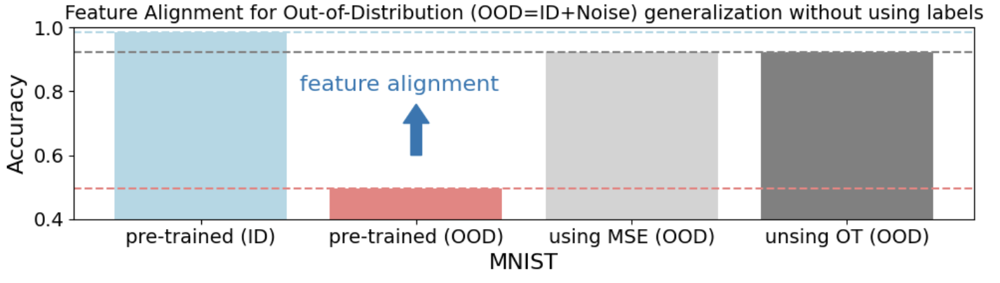

# feature alignment learning for Out-of-Distribution (OOD) generalization

## Feature alignment to generalize models to unlabeled out-of-distribution samples (OODs) using Mean Squared Error (MSE) and Optimal Transport (OT). Showcase with MNIST and a simlpe CNN. The notebook explicitly assumes that (1) pairing between ID and ODD is known. (2) large and diverse ODDs for learning feature alignment exist.

