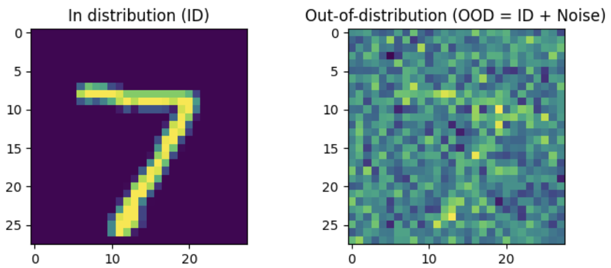

# feature alignment learning for Out-of-Distribution (OOD) generalization

### Feature alignment to generalize models to unlabeled out-of-distribution samples (OODs) using Mean Squared Error (MSE) and Optimal Transport (OT). Showcase with MNIST and a simlpe CNN. The notebook explicitly assumes that (1) pairing between ID and ODD is known. (2) large and diverse ODDs for learning feature alignment exist.

To create the OOD sample from MNIST, we add a guassian noise to add a distribution shift

By minimizing the distance between the learning representation (i.e. layers output) between ID and OOD using either MSE or OT, the pre-trained model is able generalize to OODs and improve the accuracy from accuracy of ~0.5 to ~0.9 (by ~ 40%).

