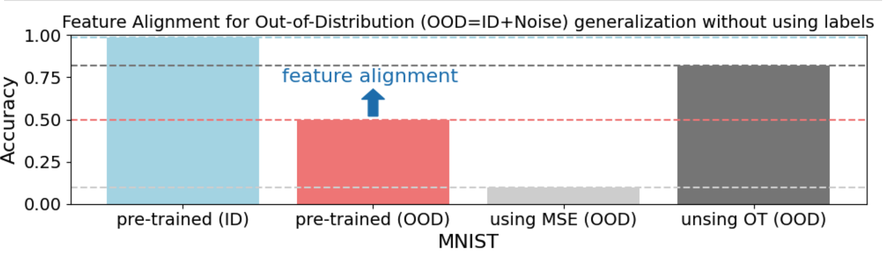

## Feature alignment learning for unlabeled Out-of-Distribution (OOD) generalization 

Feature alignment to generalize models to unlabeled out-of-distribution samples (OODs) using Mean Squared Error (MSE) and Optimal Transport (OT). Showcase with MNIST and a simlpe CNN. The notebook explicitly assumes that (1) pairing between In-distribution samples (IDs) and OODs is known. (2) large and diverse ODDs for learning feature alignment exist.

To create the OOD sample from MNIST, we add a guassian noise to add a distribution shift

By minimizing the distance between the learning representation (i.e. layers output) between ID and OOD using either MSE or OT, the pre-trained model is able generalize to OODs and improve the accuracy from accuracy of ~0.5 to ~0.9 (by ~ 40%).

Awesome! Now lets assume that the pairing between IDs and OODs is unkown (by shuffling the OODs). In this case, feature alignment with OT works but with MSE does not, and accuracy improves from ~0.5 to ~0.8 (by ~ 30%). 

Next steps will involve assuming that only fewer OOD classes exist. Stay tuned!

